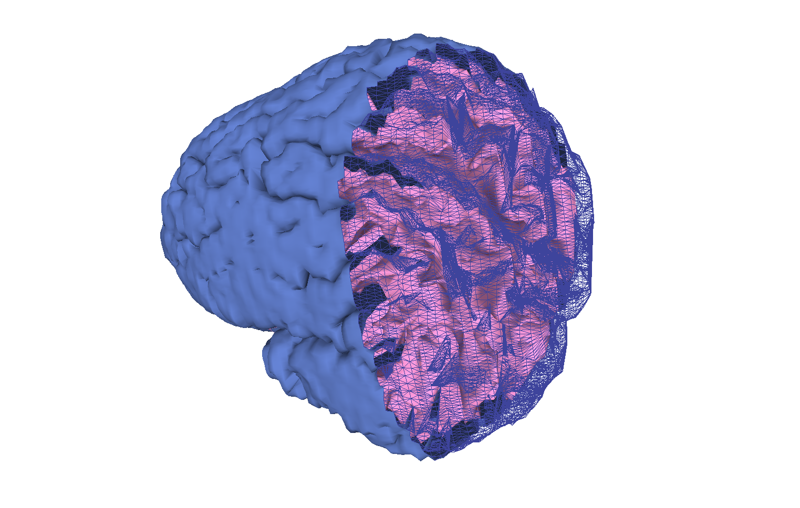

# Stitcher
Reconstruction of 3D Surfaces

# Introduction

  Based on ___ ,  we developed a code that could reconstruct a 3D surface given 2D planar contours to start from. The idea is to connect M points in a plane to N points on another plane in the most parsimonious way possible, which is accomplish-able by minimizing the total length of the connection lines. On the process of doing so, the program can also connect contours that belong to a same plane by making connecting their nearest points.
  One tool that will be used to improve the final surface is:

      . Artificially improving the resolution by interpolating the coefficients of the Fourier's Series of each contour

  The goal of this code is to be able to create 3D models of brains for futher analysis in our lab, [metaBIO](https://metabio.netlify.app).

# Libraries Used

    . Numpy

# The Input

  Create either a sequence of Points() or a numpy array as numpy.array([x,y,z]*N) and pass it to the Perimeter() class: Perimeter(list_of_points).
  From there, one could use a series of correction algorithms from the Perimeter class to match necessary reconstruction conditions.
  
      .remove_overlap()
      .area_vec()
      .fix_distance()
      .fix_intersection()
      .area_vec()

  It is also possible to merge plane contours. The algorithm will simply connect the two closest points and form a continous loop.
      .islands_ensemble(perimeter2)

  Don't forget to run fix_intersection() again, specially if the two perimeters are close to one another.

  Finally, stack up the Perimeter() in a Surface() by first creating the surface object: surface= stitcher.reconstruction.Surface(); and then adding a perimeter: surface.add_island(perimeter)

# The Output
  
  To get the output, simply call Surface().Vertices() and Surface().Edges(). The output can be saved to an obj file and visualized at any obj viewer, such as [Meshlab](https://www.meshlab.net).
